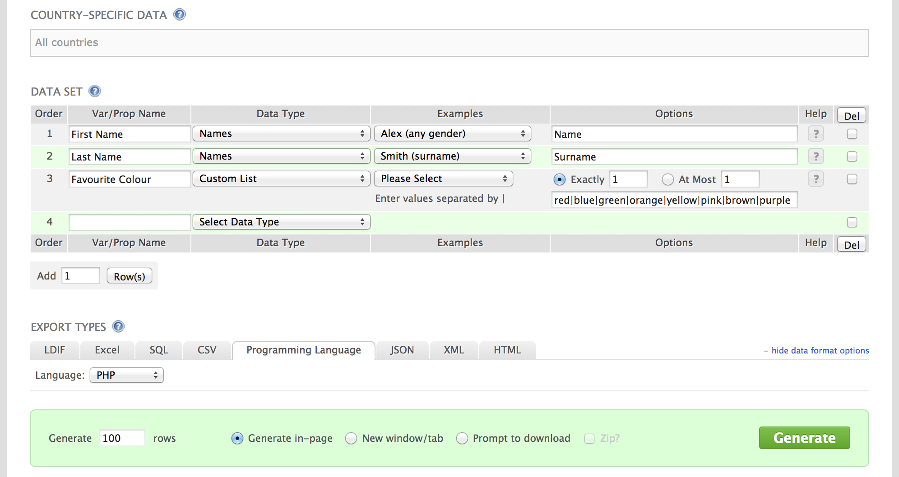
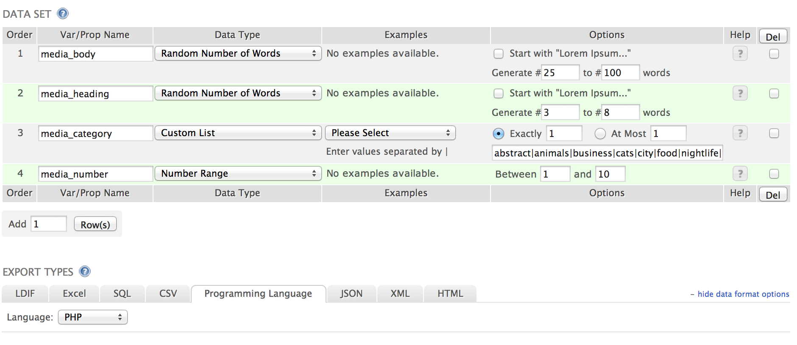

Since data sets are a common thing to encounter it is important to know how to work with nested arrays.

The code in this lesson is of the sort we would use in page templates or widgets.

## Definition Lists of People

Previously we used an associative array describing ourselves as the basis of generating a `<dl>`. The associative array was describing a single entity, _you_.

What if instead we needed data describing many entities? For instance if we needed to output the same information for many people.

Navigate to [http://www.generatedata.com/](http://www.generatedata.com/). Fill in the forms as such:

.

If the site is not working, you can find an example of the generated data [here](../sample-data/first-name_last-name_fav-colour.php.txt).

```html+php
<?php
include 'people-data.php';
?><!DOCTYPE html>
<html>
<head>
	<title>People Data</title>
	<style type="text/css">
		dt {
			font-weight: bold;
		}
	</style>
</head>
<body>
	<?php foreach ($data as $person): ?>
		<dl>
			<?php foreach ($person as $key => $value): ?>
				<dt>
					<?php echo $key; ?>
				</dt>
				<dd>
					<?php echo $value; ?>
				</dd>
			<?php endforeach ?>
		</dl>
	<?php endforeach ?>
</body>
</html>
```

<div class="alert alert-warning">
	Notice how there is no space between the first `&lt;?php ... ?&gt;` and `&lt;!DOCTYPE html&gt;`? This important to do for supporting older versions of IE. It prevents the browser from going into "quirks mode".
</div>

## Media Objects

For this portion we will be using [the Bootstrap media object](http://getbootstrap.com/components/#media) and [Lorem Pixel](http://lorempixel.com/).

We will begin by creating our own data to be used and then switch to using generated data.

Every [media object](http://getbootstrap.com/components/#media) has three distinct pieces of data:

- the image url
- a heading
- a message body (or excerpt)

Now generate another data set as such:



`media_category` and `media_number` correspond to parameters we will use on Lorem Pixel. The categories are:

	abstract|animals|business|cats|city|food|nightlife|fashion|people|nature|sports|technics|transport

If the site is not working you can find a copy of the generated data [here](../sample-data/media-data.php.txt).

```html+php
<?php
include 'media-data.php';
?><!DOCTYPE html>
<html>
<head>
	<title>Media Data</title>
	<link rel="stylesheet" href="//netdna.bootstrapcdn.com/bootstrap/3.1.1/css/bootstrap.min.css">
</head>
<body>
	<div class="container">
		<div class="row">
			<div class="col-sm-6">
				<?php foreach ($data as $media): ?>
					<div class="media">
						<a class="pull-left" href="#">
							/<?php
									echo $media['media_number'];
									?>"
							>
						</a>
						<div class="media-body">
							<h2 class="media-heading">
								<?php echo $media['media_heading']; ?>
							</h2>
							<?php echo $media['media_body'] ?>
						</div>
					</div>
				<?php endforeach ?>
			</div>
		</div>
	</div>
</body>
</html>
```

## Exercises

### Exercise 1

Given

```php
<?php
$users = array(
	'awalker'=>array(
		'name'=>'Andrew Walker',
		'address'=>'424 Gertrude Ave.',
		'occupation'=>'Code Grunt'
	),

	'bbarker'=>array(
		'name'=>'Bob Barker',
		'address'=>'1234 Middleton Lane',
		'occupation'=>'Heavy Duty Mechanic'
	),

    'jspringfield'=>array(
		'name'=>'Jeremiah Springfield',
		'address'=>'225 Gertrude Ave.',
		'occupation'=>'Woodsman'
	),

    'bsaget'=>array(
		'name'=>'Bob Saget',
		'address'=>'Full House, San Francisco',
		'occupation'=>'Aristocrat'
	),

	'pherman'=>array(
		'name'=>'PeeWee Herman',
		'address'=>'PeeWee\'s Playhouse, Puppet Land',
		'occupation'=>'Bachelor'
	)
);
?>
```

Use a `foreach` loop to generate HTML as such:

```html
<table>
	<thead>
		<tr>
			<th>Username</th>
			<th>Name</th>
			<th>Address</th>
			<th>Occupation</th>
		</tr>
	</thead>
	<tbody>
		<tr>
			<td>awalker</td>
			<td>Andrew Walker</td>
			<td>424 Gertrude Ave.</td>
			<td>Code Grunt</td>
		</tr>
		<tr>
			<td>bbarker</td>
			<td>Bob Barker</td>
			<td>1234 Middleton Lane</td>
			<td>Heavy Duty Mechanic</td>
		</tr>
		<!-- etc. -->
	</tbody>
</table>
```

### Exercise 2

